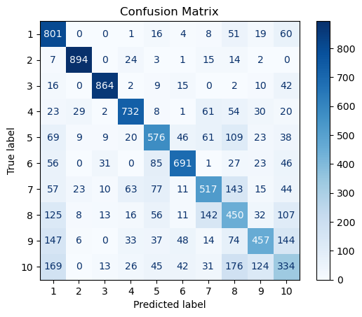
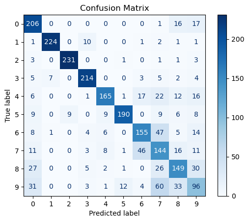
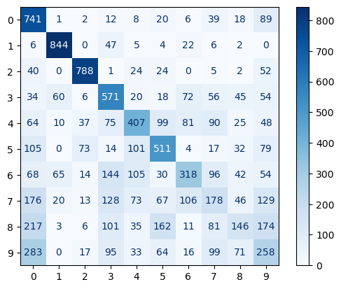
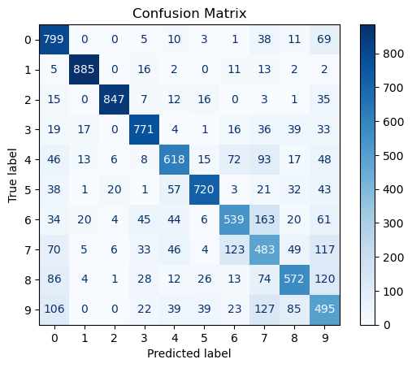
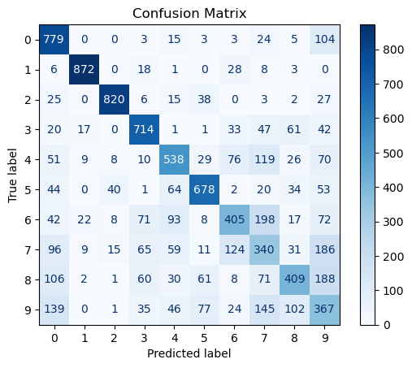

# Signal Processing in Bio Signals: A Comparative Analysis of Wavelet Families for sEMG Hand Gesture Classification

[](https://www.python.org/downloads/)
[](LICENSE)
[]()

## 📋 Table of Contents

- [Overview](#overview)
- [Dataset Description](#dataset-description)
- [Features](#features)
- [Project Structure](#project-structure)
- [Installation](#installation)
- [Usage](#usage)
- [Methodology](#methodology)
- [Results](#results)
- [Contributing](#contributing)
- [License](#license)
- [Acknowledgments](#acknowledgments)
- [Citation](#citation)

## 🔍 Overview

This project presents a comprehensive methodology for classifying hand gestures essential for Activities of Daily Living (ADLs) using surface electromyography (sEMG) signals. The study focuses on comparing different wavelet families for optimal feature extraction and classification performance in gesture recognition systems.

### Key Objectives

- **Gesture Classification**: Automated classification of 10 distinct hand gestures using sEMG signals
- **Wavelet Analysis**: Comparative analysis of multiple mother wavelets for optimal feature extraction
- **Feature Engineering**: Implementation of both time-domain statistical features and wavelet-based features
- **Machine Learning**: Evaluation of multiple classification algorithms for gesture recognition

### Applications

- Rehabilitation systems
- Prosthetic control
- Human-computer interaction
- Assistive technology for individuals with disabilities

## 📊 Dataset Description

The project utilizes the **Dataset for multi-channel surface electromyography (sEMG) signals of hand gestures** with the following specifications:

### Signal Acquisition

- **Subjects**: 40 participants
- **Channels**: 4 sEMG channels monitoring specific muscles
  - Channel 1: Extensor Carpi Ulnaris
  - Channel 2: Flexor Carpi Ulnaris
  - Channel 3: Extensor Carpi Radialis
  - Channel 4: Flexor Carpi Radialis
- **Sampling Rate**: 2000 Hz
- **Gestures**: 10 distinct hand movements

### Recording Protocol

- **Cycles per Subject**: 5 cycles
- **Rest Period**: 30 seconds between cycles
- **Cycle Duration**: 104 seconds per cycle
  - 4 seconds initial rest
  - 10 gestures × 6 seconds each
  - 4 seconds rest between gestures


_Figure 1: Complete sEMG data visualization for one subject across all cycles_


_Figure 2: Detailed view of one cycle showing activity and rest periods_

## ✨ Features

### Signal Processing

- **Preprocessing**: Data consolidation and cleaning pipeline
- **Feature Extraction**: Dual approach using statistical and wavelet methods
- **Windowing**: 250ms sliding window for temporal analysis
- **Wavelet Analysis**: Multiple mother wavelet families comparison

### Machine Learning

- **Classification Models**:
  - Random Forest
  - Gradient Boosting
  - Logistic Regression
  - Support Vector Classifier (SVC)
  - k-Nearest Neighbors (k-NN)
  - Decision Tree
- **Cross-Validation**: Robust model evaluation framework
- **Performance Metrics**: Accuracy, Precision, Recall, F1-score

### Wavelet Families Analyzed

- Biorthogonal (bior2.2, bior3.3)
- Coiflets (coif3, coif4, coif5)
- Daubechies (db6, db8)
- Symlets (sym4, sym6, sym8)

## 📁 Project Structure

```
├── data/
│   ├── images/                     # Visualization outputs
│   │   ├── bior2.2.png            # Biorthogonal 2.2 results
│   │   ├── bior3.3.png            # Biorthogonal 3.3 results
│   │   ├── coif3.png              # Coiflet 3 results
│   │   ├── coif4.png              # Coiflet 4 results
│   │   ├── coif5.png              # Coiflet 5 results
│   │   ├── db6.png                # Daubechies 6 results
│   │   ├── db8.png                # Daubechies 8 results
│   │   ├── sym4.png               # Symlet 4 results
│   │   ├── sym6.png               # Symlet 6 results
│   │   ├── sym8.png               # Symlet 8 results
│   │   ├── stats.png              # Statistical analysis results
│   │   ├── sEMG data of all cycles for one subject.png
│   │   └── sEMG data of one cycle showing activities and rest periods.png
│   └── raw/                       # Original dataset files
├── src/
│   ├── preprocessing/             # Data preprocessing modules
│   ├── feature_extraction/        # Feature extraction algorithms
│   ├── classification/            # ML classification models
│   └── visualization/             # Result visualization tools
├── notebooks/                     # Jupyter notebooks for analysis
├── results/                       # Output files and model artifacts
├── requirements.txt               # Python dependencies
├── main.tex                      # Research paper LaTeX source
├── main.txt                      # Research paper text version
└── README.md                     # This file
```

## 🚀 Installation

### Prerequisites

- Python 3.8 or higher
- pip package manager
- Git (for cloning the repository)

### Setup Instructions

1. **Clone the repository**

```
git clone https://github.com/Abhisheksuwalka/adl.git
cd adl
```

2. **Create virtual environment** (recommended)

```
python -m venv venv
source venv/bin/activate  # On Windows: venv\Scripts\activate
```

3. **Install dependencies**

```
pip install -r requirements.txt
```

### Required Packages

```
numpy>=1.21.0
pandas>=1.3.0
scikit-learn>=1.0.0
scipy>=1.7.0
matplotlib>=3.4.0
seaborn>=0.11.0
PyWavelets>=1.1.1
jupyter>=1.0.0
```

## 💻 Usage

### Quick Start

1. **Data Preprocessing**

```
from src.preprocessing import DataProcessor

processor = DataProcessor()
processed_data = processor.load_and_preprocess('data/raw/')
processed_data.to_csv('data/processed/consolidated_data.csv')
```

2. **Feature Extraction**

```
from src.feature_extraction import StatisticalFeatures, WaveletFeatures

# Statistical features
stat_extractor = StatisticalFeatures(window_size=250)  # 250ms window
stat_features = stat_extractor.extract(processed_data)

# Wavelet features
wavelet_extractor = WaveletFeatures(wavelet='coif3', levels=4)
wavelet_features = wavelet_extractor.extract(processed_data)
```

3. **Classification**

```
from src.classification import ModelEvaluator

evaluator = ModelEvaluator()
results = evaluator.evaluate_all_models(features, labels)
evaluator.generate_report(results)
```

### Running the Complete Pipeline

```
python main.py --config config/default.yaml
```

### Jupyter Notebooks

Explore the analysis interactively:

```
jupyter notebook notebooks/
```

- `01_data_exploration.ipynb`: Dataset analysis and visualization
- `02_feature_extraction.ipynb`: Feature engineering methods
- `03_wavelet_comparison.ipynb`: Wavelet family comparison
- `04_classification_analysis.ipynb`: Model evaluation and results

## 🔬 Methodology

### Data Processing Pipeline

1. **Data Consolidation**: Merge sEMG data from 40 subjects into unified DataFrame
2. **Exploratory Analysis**: Identify data quality issues and signal characteristics
3. **Label Assignment**: Add activity_id, cycle_id, and subject_id metadata
4. **Quality Assurance**: Validate data integrity and completeness

### Feature Extraction Methods

#### Statistical Features (Time-Domain)

- **Window Size**: 250ms sliding window
- **Features per Channel**: 16 statistical measures

  - Mean (μ)
  - Median
  - Variance (σ²)
  - Standard deviation
  - Skewness
  - Kurtosis
  - Min/Max values
  - Range
  - Root Mean Square (RMS)
  - Mean Absolute Value (MAV)
  - Zero crossings
  - Slope sign changes
  - Waveform length
  - Willison amplitude
  - Signal energy
  - Log detector

- **Total Features**: 64 attributes (16 × 4 channels)


_Figure 3: Statistical feature extraction results and model performance comparison_

#### Wavelet Transform Features

- **Transform Type**: Discrete Wavelet Transform (DWT)
- **Mathematical Framework**:

  The DWT decomposes signals into approximation and detail coefficients:

  ```
  c_{j,k} = ∫ x(t) ψ_{j,k}(t) dt
  ```

  where c\_{j,k} represents wavelet coefficients for scale j and position k.

- **Wavelet Families**: Comprehensive comparison of 9 mother wavelets
- **Decomposition Levels**: 2-4 levels tested for optimal performance
- **Features Extracted**:
  - Energy distribution across decomposition levels
  - Entropy measures
  - Statistical properties of coefficients (mean, variance, skewness, kurtosis)

### Classification Models

Six machine learning algorithms evaluated:

1. **Random Forest**: Ensemble method with bootstrap aggregation
2. **Gradient Boosting**: Sequential weak learner improvement
3. **Logistic Regression**: Linear probabilistic classification
4. **Support Vector Classifier**: Maximum margin classification
5. **k-Nearest Neighbors**: Instance-based learning
6. **Decision Tree**: Rule-based hierarchical classification

### Performance Evaluation

- **Cross-Validation**: Stratified k-fold validation
- **Metrics**: Accuracy, Precision, Recall, F1-score
- **Comparative Analysis**: Statistical vs. wavelet features performance

## 📈 Results

### Statistical Feature Classification Performance

| Model                     | Accuracy (%) |
| ------------------------- | ------------ |
| Random Forest             | 67           |
| Decision Tree             | 63           |
| k-Nearest Neighbors       | 61           |
| Support Vector Classifier | 58           |
| Logistic Regression       | 54           |

### Wavelet Feature Classification Results

**Best Performing Wavelets** (Random Forest Classifier):

| Wavelet   | Level | Test Accuracy (%) | Train Accuracy (%) | Precision | Recall | F1-Score |
| --------- | ----- | ----------------- | ------------------ | --------- | ------ | -------- |
| **coif3** | 4     | **56.41**         | 98.48              | 0.5871    | 0.5641 | 0.5625   |
| coif4     | 2     | 55.11             | 98.36              | 0.5735    | 0.5511 | 0.5504   |
| sym4      | 2     | 54.92             | 98.54              | 0.5723    | 0.5492 | 0.5485   |
| db8       | 2     | 54.59             | 85.70              | 0.5698    | 0.5459 | 0.5453   |
| db6       | 2     | 54.55             | 93.43              | 0.5703    | 0.5455 | 0.5454   |

### Key Findings

1. **Optimal Wavelet**: Coiflet 3 (coif3) achieved the highest test accuracy of 56.41%
2. **Feature Superiority**: Statistical features (67% accuracy) outperformed wavelet features
3. **Model Performance**: Random Forest consistently performed best across both feature types
4. **Generalization**: Some models showed signs of overfitting with high train vs. test accuracy gaps

### Wavelet Family Visualizations

The following images show the performance comparison across different wavelet families:

#### Biorthogonal Wavelets


_Figure 4: Performance analysis of Biorthogonal 2.2 wavelet across different decomposition levels_


_Figure 5: Performance analysis of Biorthogonal 3.3 wavelet across different decomposition levels_

#### Coiflet Wavelets


_Figure 6: Performance analysis of Coiflet 3 wavelet - Best performing wavelet with 56.41% accuracy_


_Figure 7: Performance analysis of Coiflet 4 wavelet across different decomposition levels_


_Figure 8: Performance analysis of Coiflet 5 wavelet across different decomposition levels_

#### Daubechies Wavelets


_Figure 9: Performance analysis of Daubechies 6 wavelet across different decomposition levels_


_Figure 10: Performance analysis of Daubechies 8 wavelet across different decomposition levels_

#### Symlet Wavelets


_Figure 11: Performance analysis of Symlet 4 wavelet across different decomposition levels_


_Figure 12: Performance analysis of Symlet 6 wavelet across different decomposition levels_


_Figure 13: Performance analysis of Symlet 8 wavelet across different decomposition levels_

### Performance Analysis

- **Coiflet wavelets** showed superior performance, particularly coif3 and coif4
- **Symlet wavelets** demonstrated consistent mid-range performance
- **Daubechies wavelets** provided stable results across different levels
- **Biorthogonal wavelets** showed the most variable performance

## 🔮 Future Work

### Planned Improvements

1. **Leave-One-Subject-Out Cross-Validation [Implemented.]**

   - Implementation of more robust validation methodology
   - Assessment of inter-subject variability
   - Enhanced generalization evaluation

2. **Advanced Feature Engineering**

   - Hybrid features combining statistical and wavelet methods
   - Time-frequency domain features
   - Deep learning-based automatic feature extraction

3. **Real-Time Implementation**

   - Optimization for real-time processing
   - Embedded system deployment
   - Low-latency classification pipeline

4. **Enhanced Dataset**
   - Increased subject diversity
   - Additional gesture types
   - Multi-session recordings for robustness evaluation

## 🤝 Contributing

I welcome contributions to improve this project! Please follow these guidelines:

### How to Contribute

1. **Fork the repository**
2. **Create a feature branch**
   ```
   git checkout -b feature/new-feature
   ```
3. **Make your changes**
4. **Add tests** for new functionality
5. **Commit your changes**
   ```
   git commit -m 'Add new feature'
   ```
6. **Push to the branch**
   ```
   git push origin feature/new-feature
   ```
7. **Open a Pull Request**

### Contribution Areas

- Algorithm improvements
- New feature extraction methods
- Performance optimization
- Documentation enhancements
- Bug fixes and testing

## 📄 License

This project is licensed under the MIT License - see the [LICENSE](LICENSE) file for details.

```
MIT License

Copyright (c) 2025 [Your Name]

Permission is hereby granted, free of charge, to any person obtaining a copy
of this software and associated documentation files (the "Software"), to deal
in the Software without restriction, including without limitation the rights
to use, copy, modify, merge, publish, distribute, sublicense, and/or sell
copies of the Software, and to permit persons to whom the Software is
furnished to do so, subject to the following conditions:

The above copyright notice and this permission notice shall be included in all
copies or substantial portions of the Software.

THE SOFTWARE IS PROVIDED "AS IS", WITHOUT WARRANTY OF ANY KIND, EXPRESS OR
IMPLIED, INCLUDING BUT NOT LIMITED TO THE WARRANTIES OF MERCHANTABILITY,
FITNESS FOR A PARTICULAR PURPOSE AND NONINFRINGEMENT. IN NO EVENT SHALL THE
AUTHORS OR COPYRIGHT HOLDERS BE LIABLE FOR ANY CLAIM, DAMAGES OR OTHER
LIABILITY, WHETHER IN AN ACTION OF CONTRACT, TORT OR OTHERWISE, ARISING FROM,
OUT OF OR IN CONNECTION WITH THE SOFTWARE OR THE USE OR OTHER DEALINGS IN THE
SOFTWARE.
```

## 🙏 Acknowledgments

### Academic Supervision

- **Dr. Lokendra Chouhan** - Project guidance and technical supervision
- **Dr. Anish Chand Turlapaty** - Computational resources and infrastructure support

### Research Team

- **Abhishek Suwalka** - Department of ECE, Indian Institute of Information Technology, Sri City

### Dataset Contributors

Special acknowledgment to the authors of the original dataset:

- **Mehmet Akif Ozdemir**
- **Deniz Hande Kisa**
- **Onan Guren**
- **Aydin Akan**

For their contribution: "Dataset for multi-channel surface electromyography (sEMG) signals of hand gestures"

### Institutional Support

- **Indian Institute of Information Technology, Sri City** - Research facilities and academic environment

### Dataset Citation

```
@article{ozdemir2024dataset,
  title={Dataset for multi-channel surface electromyography (sEMG) signals of hand gestures},
  author={Ozdemir, Mehmet Akif and Kisa, Deniz Hande and Guren, Onan and Akan, Aydin},
  journal={Data Article},
  year={2024}
}
```

---

## 📞 Contact

**Abhishek Suwalka**

- Email: [suwalkabhishek@gmail.com](mailto:suwalkabhishek@gmail.com)
- Institution: Indian Institute of Information Technology, Sri City
- Department: Electronics and Communication Engineering

**Project Repository**: [https://github.com/yourusername/semg-gesture-classification](https://github.com/yourusername/semg-gesture-classification)

---

<p align="center">
  <sub>Built with ❤️ for biomedical signal processing and human-computer interaction</sub>
</p>
